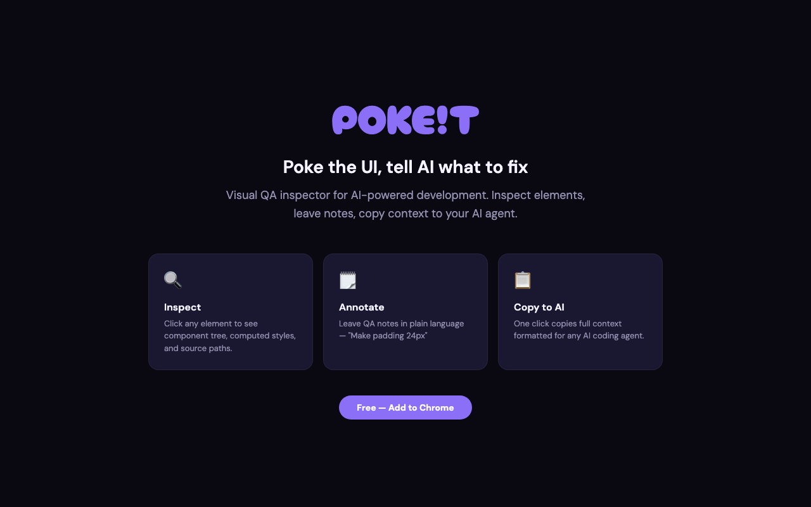
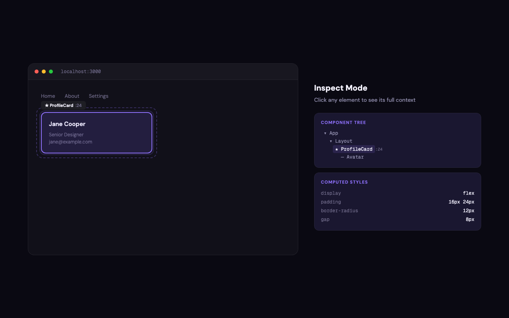
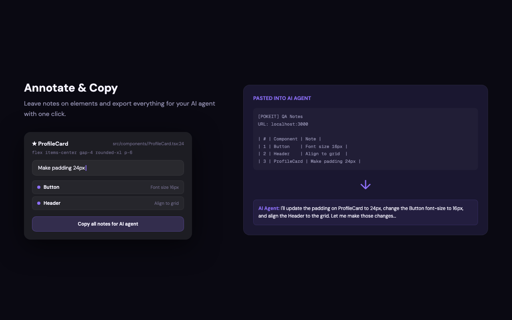

  

<h1 align="center">POKEIT</h1>

  <b>POKE! the UI. Tell AI what to fix.</b> 
  고치고 싶은 UI를 폭! 찍고 AI에게 수정 요청하세요.

  
  

  <a href="https://pokeit.app">Website</a> · <a href="#installation--설치-방법">Install</a> · <a href="#features--주요-기능">Features</a>

---

## What is POKEIT? / POKEIT이란?

POKEIT is a free Chrome extension that turns your browser into a visual QA tool for AI-powered development. Inspect any element, leave a QA note in plain language, and copy the full component context — tree, computed styles, source paths — straight to your AI coding agent. No npm packages, no project config — just install the extension and go.

POKEIT은 브라우저를 AI 개발용 비주얼 QA 도구로 바꿔주는 크롬 익스텐션입니다. 고치고 싶은 UI를 폭! 찍으면 React 트리·스타일·소스 경로가 통째로 복사되고, 그대로 AI 에이전트한테 넘기면 됩니다. npm 설치 없이, 프로젝트 세팅 없이, 어떤 React 사이트에서든 익스텐션만 깔면 바로 동작합니다.

---

## How it works / 작동 방식

### 1. Inspect / 검사
Press `⌥P` or Option-click any element. POKEIT reads the React component tree, computed styles, and source file location. Use `↑` `↓` arrow keys to navigate to parent or child elements.
`⌥P` 누르거나 Option-클릭하면 끝. 컴포넌트 트리, 스타일, 소스 위치를 알아서 읽어옵니다. `↑` `↓` 화살표 키로 부모/자식 요소를 탐색할 수 있습니다.

  

### 2. Annotate / 메모
Leave a note — *"Make this 16px"* or *"Align to grid"*. Stack as many notes as you need.
*"이 컴포넌트 사이 갭을 24px로 줄여줘"* — 이런 식으로 메모 남기면 됩니다. 여러 개 쌓아도 OK.

### 3. Copy to AI / AI에게 전달
One click copies all notes with full component context. Paste into Claude Code, Cursor, or any AI agent.
복사 한 번이면 노트 + 컴포넌트 컨텍스트가 통째로 클립보드에. Claude Code, Cursor 등 아무데나 붙여넣으면 됩니다.

  

---

## Features / 주요 기능

| Feature | Description |
|---------|-------------|
| **Component Tree** | Reads React fiber — component names, source file paths, and line numbers. React fiber를 읽어서 컴포넌트 이름, 소스 파일 경로, 라인 번호까지 잡아줍니다. |
| **Computed Styles** | Shows resolved CSS values and detects spacing overlaps between parent and child. 계산된 CSS 값을 보여주고, 부모-자식 간 간격 겹침도 감지합니다. |
| **Keyboard Navigation** | Use `↑` `↓` to traverse parent/child elements without re-clicking. `↑` `↓` 키로 부모/자식 요소를 마우스 없이 탐색할 수 있습니다. |
| **Smart Class Filter** | Filters out hashed class names (CSS Modules, styled-components, Emotion, StyleX) and shows clean Tailwind utilities. 해시된 클래스명은 자동 필터링하고, Tailwind 유틸리티는 깔끔하게 보여줍니다. |
| **QA Notes** | Leave plain-language notes on any element. Notes are saved per site and persist across page reloads. 아무 요소에나 메모를 남길 수 있고, 사이트별로 자동 저장됩니다. 새로고침해도 날아가지 않습니다. |
| **Screenshot** | Download a screenshot of the current page with one click from the QA panel. QA 패널에서 클릭 한 번으로 현재 페이지 스크린샷을 저장할 수 있습니다. |
| **One-Click Copy** | Exports all notes with full context — tree, styles, source paths — formatted for AI agents. 노트 + 트리 + 스타일 + 소스 경로를 AI 에이전트용 포맷으로 한 번에 복사합니다. |
| **Zero Config** | Works on any React site — production or localhost. No project setup required. 어떤 React 사이트든 바로 동작합니다. 프로젝트별 설정이 필요 없습니다. |

---

## Installation / 설치 방법

**[Chrome Web Store](https://chromewebstore.google.com/detail/pokeit-%E2%80%94-visual-qa-inspec/dbjfemfcgaebmpnkppokcokefnihealm)** — 클릭 한 번이면 끝!

수동 설치를 원하시면 [pokeit-extension.zip](./pokeit-extension.zip)을 다운로드해서 `chrome://extensions` → 개발자 모드 → 압축해제된 확장 프로그램 로드로 설치할 수 있습니다.

---

## Roadmap / 앞으로의 계획

I bought the domain for 5 years — POKEIT is here to stay. Actively developing new features and improvements.
pokeit.app 도메인을 5년 샀습니다... — POKEIT 포킷은 모두가 더 예쁜 디자인을 할 수 있도록 계속해서 디벨롭하겠습니다!

---

## Contact / 연락처

Got feedback, ideas, or bugs to report? Reach out:

의견이나 버그 제보 언제든 환영합니다:

- **KR:** [@0x3den](https://x.com/0x3den)
- **EN:** [@sejinxjung](https://x.com/sejinxjung)
- **LinkedIn:** [sejinxjung](https://linkedin.com/in/sejinxjung)

---

  <a href="https://pokeit.app">pokeit.app</a>

